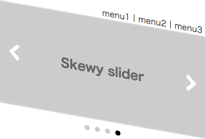

# nanameSlider
## nanameSlider is the free and simple skew content slider jQuery plugin.

- Uses native CSS3 translate3d and skewY.
- Slides can contain HTML content, or images
- Fully responsive - adapt to any device</li>
- Mobile touch slider
- Browser support: Firefox, Chrome, Safari, iOS, Android, IE11
- Tons of configuration options

## Getting Started
  * [Document](https://www.wotbu.com/dev/jquery/naname_slider/)
  * [Demos](https://www.wotbu.com/dev/jquery/naname_slider/demo.html) 

Copyright (c) 2017 Kaz Dohman
Licensed under the [MIT license][MIT].

[MIT]: http://www.opensource.org/licenses/mit-license.php
